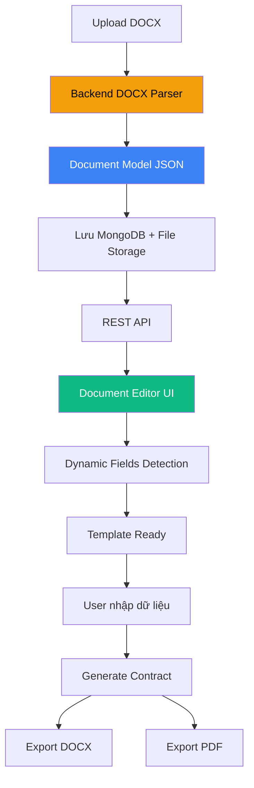

# 📋 Plan: Document Editor + DOCX Parser System

## Phân tích hiện trạng

### Hệ thống hiện tại đã có:

| Module | File | Mô tả |
|---|---|---|
| **Template Model** | [template.model.js](file:///d:/webhopdong/backend/src/models/template.model.js) | name, category, status, currentVersion, organizationId |
| **Template Version** | [template-version.model.js](file:///d:/webhopdong/backend/src/models/template-version.model.js) | fields[], templateContentHtml, fileKey, version |
| **Contract Model** | [contract.model.js](file:///d:/webhopdong/backend/src/models/contract.model.js) | templateId, code, title, status, currentVersion |
| **Contract Version** | [contract-version.model.js](file:///d:/webhopdong/backend/src/models/contract-version.model.js) | inputData, renderedContent, fileKeyDocx, fileKeyPdf |
| **Template Service** | [template.service.js](file:///d:/webhopdong/backend/src/services/template.service.js) | CRUD + plan limits + parseDocxPlaceholders |
| **Contract Service** | [contract.service.js](file:///d:/webhopdong/backend/src/services/contract.service.js) | renderContractText + generatePdfBuffer (Puppeteer) |
| **Template Routes** | [template.routes.js](file:///d:/webhopdong/backend/src/routes/template.routes.js) | 7 endpoints + multer upload |
| **Frontend Templates** | [TemplatesPage.jsx](file:///d:/webhopdong/frontend/src/features/templates/TemplatesPage.jsx) | Upload DOCX → Mammoth → cleanWordHtml → preview |
| **Frontend Contracts** | [ContractsPage.jsx](file:///d:/webhopdong/frontend/src/features/contracts/ContractsPage.jsx) | Form input → generate → view/print |
| **Auth/RBAC** | authMiddleware + rbacGuard | Token auth + role-based access |
| **Multi-tenant** | tenantContextMiddleware | Organization-scoped data |
| **Plan/Subscription** | _checkPlanLimits | FREE/BASIC/PRO/VIP limits |

### Vấn đề hiện tại (cần cải tiến):

1. **DOCX parsing trên frontend** (Mammoth) — không kiểm soát được, mất nhiều formatting
2. **Không lưu Document Model** — chỉ lưu `templateContentHtml` (HTML string)
3. **Không lưu file DOCX gốc** — `fileKey` đang empty
4. **Layout dùng CSS heuristic** — thêm/xóa styles thủ công trong `cleanWordHtml`
5. **Không có editor thực sự** — chỉ preview readonly HTML
6. **Export DOCX** — chưa implement (chỉ có PDF qua Puppeteer)

---

## Kiến trúc mới



---

## Kế hoạch triển khai — 6 Phase

---

### Phase 1: Backend DOCX Parser + Document Model
**Mục tiêu**: Chuyển toàn bộ DOCX parsing lên backend, tạo Document Model chuẩn

#### 1.1 Tạo DOCX Parser module

**File mới**: `backend/src/lib/docx-parser/`

```
backend/src/lib/docx-parser/
├── index.js              ← Entry point
├── zip-reader.js         ← Đọc ZIP, extract XML files  
├── style-resolver.js     ← Parse styles.xml, resolve style inheritance
├── numbering-resolver.js ← Parse numbering.xml, resolve list levels
├── paragraph-parser.js   ← Parse <w:p> → paragraph block
├── run-parser.js         ← Parse <w:r> → text run
├── table-parser.js       ← Parse <w:tbl> → table block
├── image-parser.js       ← Parse images, extract from media/
├── section-parser.js     ← Parse page settings (size, margins, orientation)
├── header-footer-parser.js ← Parse headers/footers
├── relationship-resolver.js ← Parse _rels/*.xml.rels
└── unit-converter.js     ← Twips/EMU/HalfPoints → mm/pt/px
```

> [!IMPORTANT]
> Dùng `PizZip` (đã có trong project) để đọc ZIP. Không cần thêm dependency.

**Input**: DOCX file buffer
**Output**: Document Model JSON

#### 1.2 Document Model Schema

```js
// Document Model — independent of XML, independent of React
{
  meta: {
    filename: "hop_dong_lao_dong.docx",
    parsedAt: "2025-12-01T00:00:00Z",
    parserVersion: "1.0"
  },
  
  defaultStyle: {
    fontFamily: "Times New Roman",
    fontSize: 13,        // pt
    color: "#000000",
    lineSpacing: 1.5,
    alignment: "justify"
  },
  
  sections: [{
    page: {
      width: 210,        // mm (A4)
      height: 297,       // mm
      marginTop: 20,     // mm
      marginBottom: 20,
      marginLeft: 30,
      marginRight: 20,
      orientation: "portrait"
    },
    
    header: { blocks: [...] },  // nullable
    footer: { blocks: [...] },  // nullable
    
    blocks: [
      // Paragraph block
      {
        type: "paragraph",
        styleId: "Normal",
        alignment: "center",  // left|center|right|justify
        indent: {
          left: 0,            // mm
          right: 0,
          firstLine: 0,
          hanging: 0
        },
        spacing: {
          before: 0,          // pt
          after: 6,
          line: 1.5,          // multiplier or pt
          lineRule: "auto"    // auto|exact|atLeast
        },
        keepWithNext: false,
        pageBreakBefore: false,
        
        numbering: null,  // or { numId, level, format, text }
        
        runs: [{
          type: "text",
          text: "HỢP ĐỒNG LAO ĐỘNG",
          fontFamily: "Times New Roman",
          fontSize: 16,      // pt
          bold: true,
          italic: false,
          underline: null,   // null | "single" | "double" | ...
          strike: false,
          color: "#000000",
          highlight: null,
          superscript: false,
          subscript: false,
          vertAlign: null
        }]
      },
      
      // Table block
      {
        type: "table",
        width: 160,           // mm (content width)
        alignment: "center",
        borders: {
          top: { style: "single", width: 0.5, color: "#000000" },
          bottom: { style: "single", width: 0.5, color: "#000000" },
          left: { style: "single", width: 0.5, color: "#000000" },
          right: { style: "single", width: 0.5, color: "#000000" },
          insideH: { style: "single", width: 0.5, color: "#000000" },
          insideV: { style: "single", width: 0.5, color: "#000000" }
        },
        rows: [{
          height: null,       // mm or null (auto)
          cells: [{
            width: 80,       // mm
            colSpan: 1,
            rowSpan: 1,
            vertAlign: "top",
            shading: null,    // or "#F2F2F2"
            borders: { /* cell-level overrides */ },
            blocks: [/* paragraphs inside cell */]
          }]
        }]
      },
      
      // Image block
      {
        type: "image",
        relationshipId: "rId5",
        mediaPath: "word/media/image1.png",
        width: 50,           // mm
        height: 30,          // mm
        altText: "",
        inline: true         // inline vs floating
      },
      
      // Page break
      {
        type: "pageBreak"
      }
    ]
  }]
}
```

#### 1.3 Unit Converter

```
// DOCX unit system:
// - Twips (twentieths of a point): 1 inch = 1440 twips
// - Half-points: font size (e.g., 26 = 13pt)  
// - EMU (English Metric Units): 1 inch = 914400 EMU
// - Eighth-points: border width

// Conversion:
// twips → pt: twips / 20
// twips → mm: twips / 1440 * 25.4
// halfPt → pt: halfPt / 2
// emu → mm: emu / 914400 * 25.4
// emu → px (96dpi): emu / 9525
```

#### 1.4 Cập nhật Template Version Schema

**Thay đổi** [template-version.model.js](file:///d:/webhopdong/backend/src/models/template-version.model.js):

```diff
  templateVersionSchema = {
    templateId,
    organizationId,
    version,
    fields: [fieldSchema],
-   fileKey: String,
-   templateContentHtml: String,
+   originalFileKey: String,          // Path to original DOCX  
+   documentModel: Mixed,            // Document Model JSON
+   templateContentHtml: String,     // Backward compat (generated from model)
+   images: [{                       // Extracted images
+     relationshipId: String,
+     fileKey: String,               // Path in storage
+     contentType: String
+   }],
    createdBy,
  }
```

> [!NOTE]
> Giữ lại `templateContentHtml` cho backward compatibility với contracts cũ.

#### 1.5 File Storage Structure

```
uploads/
├── templates/
│   ├── original/           ← Original DOCX files
│   │   └── {orgId}_{templateId}_v{version}.docx
│   └── images/             ← Extracted images from DOCX
│       └── {templateVersionId}/
│           ├── image1.png
│           └── image2.jpg
└── contracts/
    ├── docx/               ← Generated DOCX contracts
    └── pdf/                ← Generated PDF contracts
```

#### 1.6 API Changes

```diff
  // Existing (keep)
  POST /api/templates           ← createTemplate
  GET  /api/templates           ← getTemplates
  GET  /api/templates/:id       ← getTemplateDetails
  POST /api/templates/:id/fields
  POST /api/templates/:id/publish
  POST /api/templates/:id/archive
  DELETE /api/templates/:id

  // Modified  
- POST /api/templates/parse-docx   ← old: extract placeholders only
+ POST /api/templates/upload-docx  ← new: upload + parse → Document Model

  // New endpoints
+ GET  /api/templates/:id/document      ← Get Document Model
+ PUT  /api/templates/:id/document      ← Update Document Model (from editor)
+ GET  /api/templates/:id/images/:name  ← Serve extracted images
```

---

### Phase 2: Document Renderer (Frontend)
**Mục tiêu**: Render Document Model thành "trang giấy" trung thực trên web

#### 2.1 Component Architecture

**File mới**: `frontend/src/features/templates/editor/`

```
frontend/src/features/templates/editor/
├── DocumentRenderer.jsx     ← Main renderer component
├── PageRenderer.jsx         ← Renders single page with margins
├── BlockRenderer.jsx        ← Routes block type → sub-renderer
├── ParagraphRenderer.jsx    ← Renders paragraph with runs
├── TextRunRenderer.jsx      ← Renders individual text run
├── TableRenderer.jsx        ← Renders table with cells
├── ImageRenderer.jsx        ← Renders image block
├── DynamicFieldTag.jsx      ← Renders {{placeholder}} as interactive tag
├── useDocumentModel.js      ← Hook to fetch/manage document model
└── layoutUtils.js           ← Unit conversion + layout calculations
```

#### 2.2 Layout Engine Rules

```js
// layoutUtils.js

// DOCX → Screen conversion
// A4: 210mm × 297mm
// At 96 DPI: 1mm ≈ 3.78px
// Scale factor: fit page width to container width

const MM_TO_PX = 3.7795;  // at 96 DPI

export const docxToScreen = (valueMm, scaleFactor = 1) => {
  return valueMm * MM_TO_PX * scaleFactor;
};
```

> [!WARNING]
> **Không được** thêm margin/padding/line-height bất kỳ nếu giá trị đó không có trong Document Model. Mọi khoảng cách phải xuất phát từ model.

#### 2.3 Page Renderer

```jsx
// PageRenderer.jsx
<div className="doc-page" style={{
  width: `${page.width * MM_TO_PX}px`,
  minHeight: `${page.height * MM_TO_PX}px`,
  paddingTop: `${page.marginTop * MM_TO_PX}px`,
  paddingBottom: `${page.marginBottom * MM_TO_PX}px`,
  paddingLeft: `${page.marginLeft * MM_TO_PX}px`,
  paddingRight: `${page.marginRight * MM_TO_PX}px`,
  background: '#ffffff',
  boxShadow: '0 2px 12px rgba(0,0,0,0.12)',
}}>
  {blocks.map(block => <BlockRenderer key={block.id} block={block} />)}
</div>
```

#### 2.4 Paragraph Renderer

```jsx
// ParagraphRenderer.jsx — ONLY uses values from Document Model
<p style={{
  textAlign: paragraph.alignment || 'left',
  marginLeft: `${paragraph.indent?.left || 0}mm`,
  marginRight: `${paragraph.indent?.right || 0}mm`,
  textIndent: paragraph.indent?.firstLine 
    ? `${paragraph.indent.firstLine}mm`
    : paragraph.indent?.hanging 
      ? `-${paragraph.indent.hanging}mm` 
      : '0',
  paddingLeft: paragraph.indent?.hanging 
    ? `${paragraph.indent.hanging}mm` 
    : '0',
  marginTop: `${(paragraph.spacing?.before || 0) / 2}pt`,
  marginBottom: `${(paragraph.spacing?.after || 0) / 2}pt`,
  lineHeight: paragraph.spacing?.line || 'normal',
}}>
  {paragraph.runs.map((run, i) => <TextRunRenderer key={i} run={run} />)}
</p>
```

#### 2.5 Dynamic Field Rendering

Khi phát hiện `{{ho_ten}}` trong run.text:

```jsx
// TextRunRenderer.jsx
const renderText = (text) => {
  const parts = text.split(/({{[a-zA-Z0-9_.]+}})/g);
  return parts.map((part, i) => {
    const fieldMatch = part.match(/^{{([a-zA-Z0-9_.]+)}}$/);
    if (fieldMatch) {
      return <DynamicFieldTag key={i} fieldKey={fieldMatch[1]} />;
    }
    return <span key={i}>{part}</span>;
  });
};
```

```jsx
// DynamicFieldTag.jsx
<span className="dynamic-field-tag" 
      onClick={() => onFieldClick(fieldKey)}
      style={{
        background: '#dbeafe',
        border: '1px dashed #3b82f6',
        borderRadius: '4px',
        padding: '1px 6px',
        cursor: 'pointer',
        fontWeight: 600,
        color: '#1e40af'
      }}>
  {`{{${fieldKey}}}`}
</span>
```

---

### Phase 3: Document Editor (Interactive)
**Mục tiêu**: Cho phép click vào field, chỉnh sửa properties, thêm/xóa fields

#### 3.1 Editor States

```
View Mode   → Readonly preview (giống hiện tại nhưng dùng Document Model)
Edit Mode   → Click vào text để chọn → convert sang {{placeholder}}
Field Mode  → Click field tag → hiện panel chỉnh sửa field properties
```

#### 3.2 Field Panel

Khi click vào `{{ho_ten}}`, hiện sidebar:

```
┌─ Field Properties ──────────┐
│ Key:       ho_ten            │
│ Label:     Họ và tên         │
│ Type:      [TEXT ▾]          │
│ Required:  [✓]              │
│ Default:   ___              │
│ Placeholder: Nhập họ tên... │
│                              │
│ [Xóa field]  [Lưu]         │
└──────────────────────────────┘
```

#### 3.3 Text Selection → Create Field

User workflow:
1. Switch to **Edit Mode**
2. Select text "Nguyễn Văn A" trong document
3. Click "Tạo biến" → popup chọn key
4. Text được thay bằng `{{ho_ten}}`
5. Field tự động thêm vào danh sách

> [!TIP]
> Giữ nguyên workflow hiện tại (select text → tạo biến) nhưng nâng cấp UI lên Document Model-based renderer.

---

### Phase 4: DOCX Generator
**Mục tiêu**: Từ Document Model + inputData → generate DOCX output

#### 4.1 Generator Module

**File mới**: `backend/src/lib/docx-generator/`

```
backend/src/lib/docx-generator/
├── index.js                  ← Entry: documentModel + data → DOCX buffer
├── content-builder.js        ← Build document.xml from blocks
├── style-builder.js          ← Build styles.xml from defaultStyle
├── numbering-builder.js      ← Build numbering.xml  
├── relationship-builder.js   ← Build .rels files
├── media-handler.js          ← Copy images to output package
└── template-parts.js         ← Static XML templates ([Content_Types], etc.)
```

**Approach**: Sử dụng file DOCX gốc làm template, thay thế `{{placeholder}}` bằng giá trị thực.

```js
// Preferred approach: Template-based generation
const generateDocx = async (templateVersionId, inputData) => {
  // 1. Load original DOCX from storage
  const originalDocx = await loadFile(templateVersion.originalFileKey);
  
  // 2. Use PizZip + Docxtemplater (already in project) to replace placeholders
  const zip = new PizZip(originalDocx);
  const doc = new Docxtemplater(zip, {
    paragraphLoop: true,
    linebreaks: true
  });
  
  // 3. Format values based on field types
  const formattedData = formatFieldValues(fields, inputData);
  doc.setData(formattedData);
  doc.render();
  
  // 4. Return buffer
  return doc.getZip().generate({ type: 'nodebuffer' });
};
```

> [!IMPORTANT]
> Docxtemplater (đã cài) rất phù hợp cho việc này — nó giữ nguyên 100% formatting gốc, chỉ thay thế placeholders. Không cần build XML từ đầu.

#### 4.2 PDF Generation

Giữ nguyên approach hiện tại (Puppeteer HTML → PDF) nhưng cải tiến:

```js
const generatePdf = async (documentModel, inputData) => {
  // 1. Render Document Model to styled HTML (server-side)
  const html = renderDocumentModelToHtml(documentModel, inputData);
  
  // 2. Use Puppeteer to convert to PDF
  const pdf = await puppeteerPrint(html, {
    width: documentModel.sections[0].page.width + 'mm',
    height: documentModel.sections[0].page.height + 'mm',
    margin: {
      top: documentModel.sections[0].page.marginTop + 'mm',
      bottom: documentModel.sections[0].page.marginBottom + 'mm',
      left: documentModel.sections[0].page.marginLeft + 'mm',
      right: documentModel.sections[0].page.marginRight + 'mm',
    }
  });
  
  return pdf;
};
```

---

### Phase 5: Tích hợp vào hệ thống hiện tại
**Mục tiêu**: Thay thế workflow cũ, backward compatible

#### 5.1 Upload Flow mới

```
Hiện tại:
  Frontend: Upload → Mammoth → cleanWordHtml → setCreateForm

Mới:
  Frontend: Upload → POST /api/templates/upload-docx
  Backend:  Parse DOCX → Document Model + save original file
  Frontend: GET /api/templates/:id/document → DocumentRenderer
```

#### 5.2 Migration Strategy

| Bước | Hành động | Risk |
|---|---|---|
| 1 | Thêm backend parser song song (không xóa frontend parser) | Không |
| 2 | Thêm DocumentRenderer dùng Document Model | Không |
| 3 | Thêm toggle UI: "Classic View" / "Document View" | Không |
| 4 | Test kỹ với nhiều file DOCX | Không |
| 5 | Default sang Document View | Thấp |
| 6 | Xóa Mammoth frontend code khi ổn định | Thấp |

> [!CAUTION]
> Không xóa Mammoth frontend code ngay lập tức. Giữ song song để rollback nếu cần. Chỉ xóa khi Phase 5 được user confirm ổn định.

#### 5.3 Template Version Backward Compatibility

```js
// Khi load template cũ (chỉ có templateContentHtml, không có documentModel):
if (templateVersion.documentModel) {
  // New flow: render from Document Model
  return <DocumentRenderer model={templateVersion.documentModel} />;
} else {
  // Legacy flow: render HTML directly (like current)
  return <div dangerouslySetInnerHTML={{ __html: templateVersion.templateContentHtml }} />;
}
```

---

### Phase 6: Polish + Advanced Features
**Mục tiêu**: Hoàn thiện UX, thêm tính năng nâng cao

#### 6.1 Cải tiến

- [ ] Header/Footer rendering
- [ ] Page number
- [ ] Watermark support
- [ ] Multi-section (different page layouts)
- [ ] TOC (Table of Contents)
- [ ] Footnotes
- [ ] Print preview with pagination

#### 6.2 Field Types mở rộng

```
text        ← hiện tại
number      ← hiện tại
date        ← hiện tại (yyyy-mm-dd)
date_vn     ← vừa thêm ("ngày DD tháng MM năm YYYY")
datetime    ← có trong schema
textarea    ← có trong schema
select      ← có trong schema
checkbox    ← có trong schema
currency    ← hiện tại
email       ← có trong schema
phone       ← có trong schema
address     ← có trong schema
```

#### 6.3 Export Enhancements

- [ ] Export DOCX giữ nguyên font, styling, images
- [ ] Export PDF A4 chính xác margins
- [ ] Batch export nhiều contracts
- [ ] Email contract PDF

---

## Thứ tự ưu tiên thực hiện

```mermaid
gantt
    title Lộ trình triển khai
    dateFormat X
    axisFormat %s
    
    section Phase 1
    DOCX Parser module          :p1a, 0, 3
    Document Model schema       :p1b, 0, 1
    Template Version update     :p1c, 1, 2
    File storage setup          :p1d, 2, 3
    Upload API                  :p1e, 3, 4
    
    section Phase 2
    Layout utilities            :p2a, 4, 5
    Page/Block renderers        :p2b, 5, 7
    Dynamic field rendering     :p2c, 7, 8
    
    section Phase 3
    Editor modes                :p3a, 8, 10
    Field panel                 :p3b, 10, 11
    Text selection → field      :p3c, 11, 12
    
    section Phase 4
    DOCX generator              :p4a, 12, 14
    PDF generator upgrade       :p4b, 14, 15
    
    section Phase 5
    Integration + migration     :p5a, 15, 17
    Testing                     :p5b, 17, 18
    
    section Phase 6
    Polish + advanced           :p6a, 18, 20
```



---

## Dependencies

### Đã có (không cần cài thêm):
- `pizzip` — đọc/tạo ZIP (DOCX container)
- `docxtemplater` — DOCX template engine
- `puppeteer` — PDF generation
- `multer` — file upload
- `mongoose` — MongoDB

### Cần thêm:
- **Không có** — tất cả parsing dùng built-in XML parsing (DOMParser on backend via `xmldom` hoặc regex)

> [!TIP]
> Có thể cần `@xmldom/xmldom` cho backend XML parsing (Node.js không có built-in DOMParser). Package này nhẹ (~50KB) và không có dependency.

---

## Checklist trước khi bắt đầu

- [ ] User confirm plan này OK
- [ ] Bắt đầu từ Phase 1 (backend parser)
- [ ] Mỗi phase có thể test độc lập
- [ ] Không break hệ thống hiện tại trong quá trình migration
